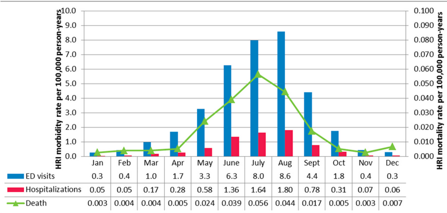

# Heat-Related Illness Morbidity and Mortality (NetLogo Model)

This NetLogo simulation models the impact of heat exposure on morbidity and mortality across different age groups, considering factors such as activity level and comorbidities. The model simulates daily heat index variations and tracks the number of individuals who become heat-exhausted, hospitalized, or die due to heat-related illnesses.

This project was developed as part of the requirements for the subject CSC133 – Modelling and Simulation in MSU-IIT. It is submitted along with my paper.

## Study Background

This study aims to replicate the results of an [existing data](https://doi.org/10.3390/ijerph13060551)  on heat-related illness (HRI) within the Florida population, stratified by month. It uses annual data from 2005–2012 and categorizes cases into two groups: non-work related HRI and work-related HRI. For this project, only non-work related HRI data are used for greater relevance and application to public health outcomes.  
**Total cases:**  
- Emergency department (ED) visits: 27,028  
- Hospitalizations: 5,324  
- Deaths: 158  

*Fig. 1 The data results of a comprehensive study of non-work related HRI in Florida, with emergency department (ED) visits, hospitalizations, and deaths. All rates are per 100,000 person-years, with morbidity rates (left y-axis) that are twice as high as mortality rates (right y-axis).*

It should be noted that the original study excluded individuals who received care at non-hospital or outside ED facilities (such as urgent care centers or doctor's offices) or those not receiving care but still alive. This simulation considers those cases as well, so a higher number of cases is expected.

## Features

- **Agent-based simulation** of individuals with age, activity, and comorbidity attributes.
- **Dynamic environment** with daily and monthly heat index changes.
- **Tracks outcomes**: heat exhaustion, hospitalization, recovery, and death.
- **Age-stratified statistics** for morbidity and mortality.
- **Visual interface** with plots and monitors for real-time tracking.

## How It Works

- The environment simulates daily heat index based on monthly averages and random variation.
- Individuals ("turtles") are assigned to age groups and given random activity levels and comorbidity status.
- Each day, individuals may become heat-exposed, leading to possible heat exhaustion, hospitalization, or death, depending on risk factors.
- The model tracks and displays statistics for each outcome.

## How to Use

1. **Open** `heat impact.nlogo` in [NetLogo](https://ccl.northwestern.edu/netlogo/).
2. Click **setup** to initialize the environment and population.
3. Click **start** to run the simulation.
4. Use the interface to monitor:
   - Number of heat-exhausted, hospitalized, and dead individuals.
   - Percentages of each outcome.
   - Plots of ED visits, heat index, hospitalizations, and mortality.

## Interface Items

- **Buttons**: `setup`, `start`
- **Monitors**: Track counts and percentages of outcomes.
- **Plots**: Visualize trends over time for ED visits, heat index, hospitalizations, and mortality.

## Things to Notice

- How heat index fluctuations affect morbidity and mortality.
- Which age groups are most affected.
- The impact of comorbidities and activity levels.

## Extending the Model

- Add more detailed comorbidity profiles.
- Incorporate interventions (e.g., cooling centers).
- Model different climate scenarios or urban/rural differences.

## License

This project is licensed under the MIT License. See [LICENSE](LICENSE) for details.

*For more information about NetLogo, visit the [NetLogo website](https://ccl.northwestern.edu/netlogo/).*